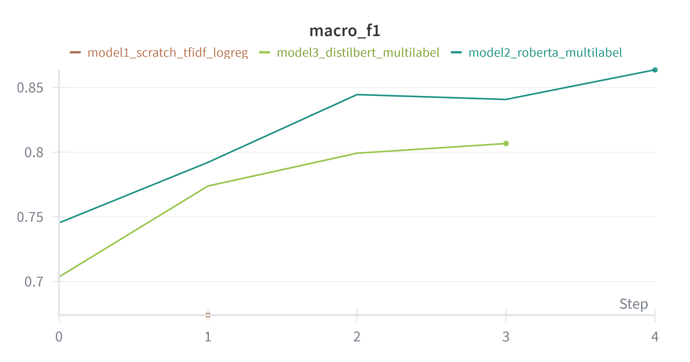

# Emotion Classification from Text – Kaggle Competition

This repository contains my complete project submission for the 2025 SEP DL–GenAI Course Kaggle Competition. The task was to classify emotions from text into 5 categories:

**anger, fear, joy, sadness, surprise**

I tried multiple models - from a basic NLP model built from scratch to fine-tuned transformer models. This repo has everything: training code, evaluation, inference, and W&B experiment tracking.

## Project Overview

| Requirement | Status |
|------------|--------|
| 3 Unique Models | Completed |
| One model from scratch | TF-IDF + Logistic Regression |
| One pretrained model | RoBERTa Base |
| Third model of choice | DistilBERT Multilabel |
| W&B Tracking | Attached |
| Inference Notebook | Included |
| Report PDF | Included |

## Dataset

Dataset provided through Kaggle course portal:
- `train.csv` → text + 5 emotion labels
- `test.csv` → text (labels to be predicted)

Each emotion is multilabel, meaning a sentence can show multiple emotions at once.

## Folder Structure

```
Emotion-Classification-Kaggle
│── README.md
│── DL_Genai Report.pdf
│── requirements.txt
│── inference-notebook.ipynb
│── milestone_4_notebook.ipynb
│── Milestone_5 (1).ipynb
│── Milestone_5.ipynb
│── milestone_5.py
│
├── DEPLOYMENT/
│     ├── App.py (2).py
│     └── requirements.txt
│
├── graphs/
│     ├── accuracy.png
│     ├── comparison_plot.png
│     └── f1_micro.png
│
├── notebooks/
│     ├── .gitkeep
│     ├── eda-notebook.ipynb
│     ├── model1_scratch_tfidf_logreg.ipynb
│     ├── model3_distilbert_multilabel.ipynb
│     ├── model_2/
│     └── preprocessing-roberta.ipynb
│
└── src/
      ├── .gitkeep
      ├── eda_notebook.py
      ├── model3_distilbert_multilabel.py
      └── preprocessing_roberta.py
```

## Models Used

### Model-1 → TF-IDF + Logistic Regression (Scratch Model)

- Converted text → TF-IDF vectors
- Trained 5 separate one-vs-rest Logistic Regression classifiers
- Fast + lightweight but accuracy was comparatively low
- W&B Run: https://wandb.ai/22f3000982-indian-institute-of-technology-madras/2025-sep-dl-genai-project/runs/soaml5h0?nw=nwuser22f3000982
- Notebook: https://colab.research.google.com/github/22f3000982/DL_genai_project/blob/main/notebooks/model1_scratch_tfidf_logreg.ipynb#scrollTo=x4W4-Wf-LRmH

### Model-2 → Fine-Tuned RoBERTa Base

- Used HuggingFace `roberta-base`
- BCEWithLogitsLoss for multilabel output
- Added scheduler + warmup + gradient clipping
- **Best performing model overall**
- W&B Run: https://wandb.ai/22f3000982-indian-institute-of-technology-madras/2025-sep-dl-genai-project/runs/k1e5g56a?nw=nwuser22f3000982
- Notebook: https://colab.research.google.com/drive/1Jpis6OQUtI32_epRLfvCctFIr95c73a5#scrollTo=5Ccv01NZ6XX8

### Model-3 → DistilBERT Multilabel

- Smaller transformer (faster than RoBERTa)
- Performance close to RoBERTa but slightly lower
- W&B Run: https://wandb.ai/22f3000982-indian-institute-of-technology-madras/2025-sep-dl-genai-project/runs/ixcsw28f?nw=nwuser22f3000982
- Notebook: https://colab.research.google.com/drive/1dIYSmXg7CuBNd63T74_57A8f8GitrTr2#scrollTo=rTYnlQhePjPW

## Summary Table

| Model | Macro-F1 | Micro-F1 | Accuracy | Notes |
|-------|----------|----------|----------|-------|
| TF-IDF + Logistic Regression | 0.67 | 0.75 | 0.53 | Scratch baseline |
| DistilBERT | 0.80 | 0.82 | 0.59 | Good trade-off b/w speed + accuracy |
| **RoBERTa (Best)** | **0.86** | **0.87** | **0.71** | ❗ Final submission model |

### W&B Comparison Graph



## Deployment

The best performing model (RoBERTa) has been deployed as an interactive web demo on HuggingFace Spaces!

**Try it out here:** [https://huggingface.co/spaces/Ashish4129/roberta-emotion-detection-demo](https://huggingface.co/spaces/Ashish4129/roberta-emotion-detection-demo)

You can enter any text and the model will predict the emotions present in real-time. The demo uses Gradio for the interface and loads the fine-tuned RoBERTa model directly from HuggingFace Hub.

## Learning / Mistakes / Experience

- Fine-tuning transformers was more tricky than expected, especially getting the scheduler and gradient clipping right
- Initially my models were overfitting a LOT; later early stopping fixed it
- W&B really helped in debugging and comparing models side by side
- In future, I want to try ensembling and proper hyper-parameter search

---

Thanks for reviewing my project

**Ashish Raj**  
22f3000982
